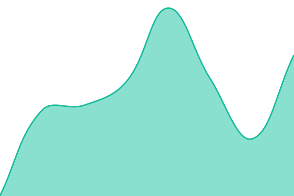
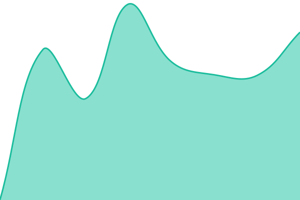
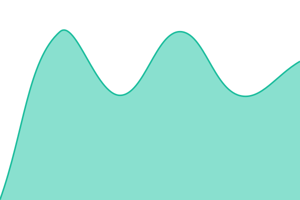
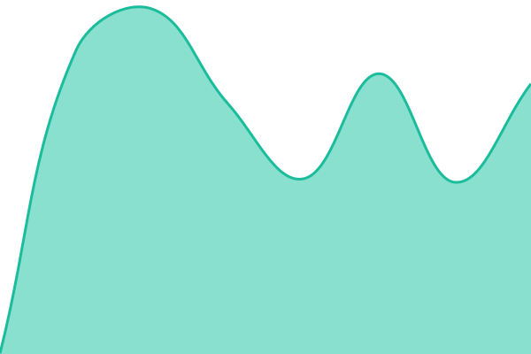
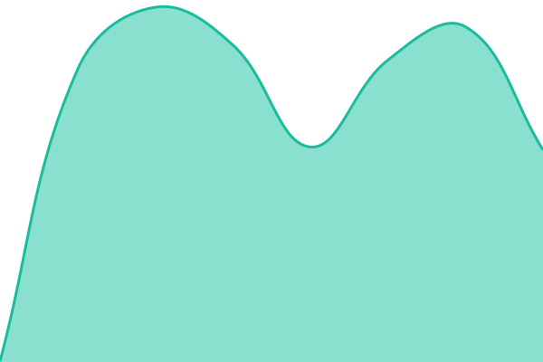

# [📈 Live Status](https://keydevelops.github.io/services): <!--live status--> **🟧 Partial outage**

This repository contains the open-source uptime monitor and status page for [PrivateKeyy](https://keydevelops.github.io/services), powered by [Upptime](https://github.com/upptime/upptime).

With [Upptime](https://upptime.js.org), you can get your own unlimited and free uptime monitor and status page, powered entirely by a GitHub repository. We use [Issues](https://github.com/keydevelops/services/issues) as incident reports, [Actions](https://github.com/keydevelops/services/actions) as uptime monitors, and [Pages](https://keydevelops.github.io/services) for the status page.

<!--start: status pages-->
<!-- This summary is generated by Upptime (https://github.com/upptime/upptime) -->
<!-- Do not edit this manually, your changes will be overwritten -->
<!-- prettier-ignore -->
| URL | Status | History | Response Time | Uptime |
| --- | ------ | ------- | ------------- | ------ |
|  [Germany Server](http://de.prvkey.ru) | 🟩 Up | [de-server.yml](https://github.com/keydevelops/services/commits/HEAD/history/de-server.yml) | 

 474ms
     
 | 

<a href="https://keydevelops.github.io/services/history/de-server">100.00%</a>
    

|  [FishingBot](https://fishingbot.prvkey.ru) | 🟩 Up | [fishingbot.yml](https://github.com/keydevelops/services/commits/HEAD/history/fishingbot.yml) | 

 659ms
     
 | 

<a href="https://keydevelops.github.io/services/history/fishingbot">100.00%</a>
    

|  [Noxveil (prvkey)](https://noxveil.prvkey.ru) | 🟩 Up | [noxveil-prvkey.yml](https://github.com/keydevelops/services/commits/HEAD/history/noxveil-prvkey.yml) | 

 716ms
     
 | 

<a href="https://keydevelops.github.io/services/history/noxveil-prvkey">100.00%</a>
    

|  [Noxveil (kiparis)](https://noxveil.kiparis.fun) | 🟥 Down | [noxveil-kiparis.yml](https://github.com/keydevelops/services/commits/HEAD/history/noxveil-kiparis.yml) | 

 0ms
     
 | 

<a href="https://keydevelops.github.io/services/history/noxveil-kiparis">8.31%</a>
    

|  [Конфигурации VPN](https://cfgx.prvkey.ru) | 🟩 Up | [flclashx-cfg.yml](https://github.com/keydevelops/services/commits/HEAD/history/flclashx-cfg.yml) | 

 622ms
     
 | 

<a href="https://keydevelops.github.io/services/history/flclashx-cfg">100.00%</a>
    

|  [Координатор WTorrent](https://wcoord.prvkey.ru) | 🟩 Up | [wcoord.yml](https://github.com/keydevelops/services/commits/HEAD/history/wcoord.yml) | 

 636ms
     
 | 

<a href="https://keydevelops.github.io/services/history/wcoord">100.00%</a>
    

<!--end: status pages-->

[**Visit our status website →**](https://keydevelops.github.io/services)

## 📄 License

- Powered by: [Upptime](https://github.com/upptime/upptime)
- Code: [MIT](./LICENSE) © [Anand Chowdhary](https://anandchowdhary.com)
- Data in the `./history` directory: [Open Database License](https://opendatacommons.org/licenses/odbl/1-0/)
